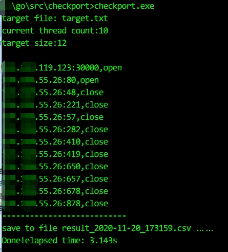

# checkport
check lots of ports

Usage:

```
checkport.exe -h
Usage of checkport_windows_amd64_v1.0.exe:
  -f string
        target file ip:port (default "target.txt")
  -h    show  help
  -t int
        thread count (default 10)
  -timeout int
        timeout (default 3)
```

